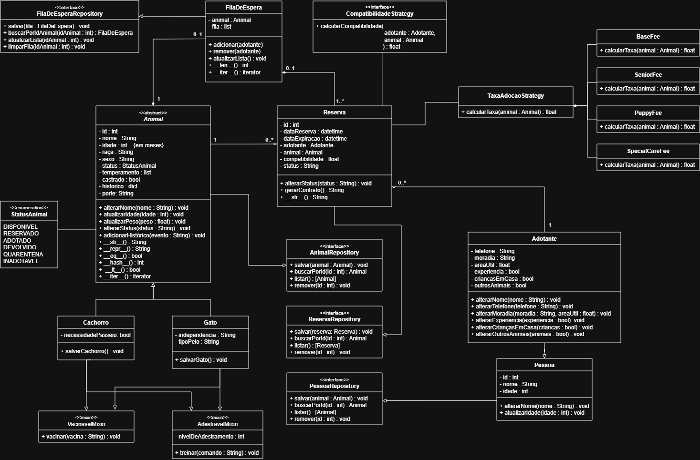

<h1 align="center">Sistema de Adoção de Animais</h1>

Projeto voltado a criação de um sistema de adoção de animais para gerenciar o cadastro de animais, triagem de adotantes, reservas, adoções, devoluções, quarentena e relatórios.

Esse é um projeto da disciplina de <strong>Programação Orientada a Objetos</strong> do curso de <strong>Engenharia de Software</strong> na <strong>Universidade Federal do Cariri (UFCA)</strong>

---
 

## Diagrama de Classes UML

---
 

## [Diagrama de Classes textual](docs\DiagramaDeClassesTextual.md)